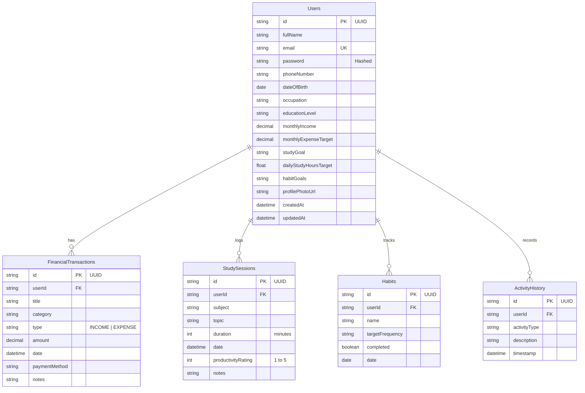

# AI-powered Personal Productivity & Finance Assistant - Milestone 1

Welcome to Milestone 1 of the Personal Productivity & Finance Assistant. This project features a secure Express.js API backend and an interactive, glassmorphic React + TypeScript frontend dashboard.

---

## 🛠️ Technology Stack
- **Frontend**: React.js, TypeScript, Vite, CSS Variables (Plus Jakarta Sans font)
- **Backend**: Node.js, Express.js, TypeScript
- **Database**: SQLite (local development), PostgreSQL DDL schema included for production deployment
- **ORM**: Prisma Client
- **Authentication**: JSON Web Token (JWT) + Bcrypt password encryption
- **Validation**: Zod Schemas

---

## 📁 Folder Structure
```
workspace/
├── schema.sql              # Raw PostgreSQL DDL Schema with PKs, FKs, constraints, and indexes
├── Postman_Collection.json # Import directly into Postman to test backend REST APIs
│
├── backend/
│   ├── prisma/
│   │   ├── schema.prisma   # Prisma schema (uses SQLite for out-of-the-box dev execution)
│   │   ├── seed.ts         # Seeds SQLite dev.db with robust mock demo datasets
│   │   └── migrations/     # Database migration history
│   │
│   ├── src/
│   │   ├── controllers/    # API Request handlers (auth, profile, finance, study, habits, activities)
│   │   ├── middleware/     # Secure protected route handlers (JWT validator)
│   │   ├── routes/         # Express endpoint route mapping
│   │   ├── utils/          # Database clients & audit logging services
│   │   ├── validators/     # Zod request validators (passwords, positive values, date strings)
│   │   └── server.ts       # Express server bootstrapper with Rate limits, CORS, Helmet
│   │
│   ├── .env                # Port, secret key, database connection url
│   ├── tsconfig.json       # Backend compile flags
│   └── package.json        # Backend server packages
│
└── frontend/
    ├── src/
    │   ├── components/     # Reusable layout fragments (Sidebar, ProtectedRoute guard)
    │   ├── contexts/       # React Context API (AuthContext handles JWT storage & sessions)
    │   ├── pages/          # Core views (Dashboard, Finance, Study, Habits, Profile, Auth screens)
    │   ├── services/       # Network API wrappers (Axios configurations)
    │   ├── index.css       # Premium custom stylesheet with variables & glassmorphism details
    │   ├── App.tsx         # Main entry point defining routing
    │   └── main.tsx        # React client mounter
    │
    ├── package.json        # Client packages
    └── vite.config.ts      # Vite flags
```

---

## 💾 Database ER Diagram

Below is the database relationship diagram in Mermaid format:



---

## ⚙️ Environment Variables

### Backend `.env`
Create a `.env` file under the `backend/` directory:
```env
PORT=5000
DATABASE_URL="file:./dev.db"
JWT_SECRET="super-secret-milestone1-key-phrase-12345"
NODE_ENV=development
```

### Frontend Environment
The frontend communicates directly with `http://localhost:5000/api` by default. If you need to custom specify the URL, configure a `.env` in the `frontend/` directory:
```env
VITE_API_URL=http://localhost:5000/api
```

---

## 🚀 Installation & Running Guide

Ensure you have **Node.js (v18+)** installed.

### 1. Database Setup & Seeding
In the `backend/` directory, initialize the SQLite database, apply structural schema tables, and seed it with a demo profile (Alex Carter):
```bash
cd backend
npm install
npx prisma migrate dev --name init
```
*Note: The migration script automatically executes the prisma seed utility `prisma/seed.ts` after tables are created.*

To spin up backend server:
```bash
npm run dev
```
The server will boot on `http://localhost:5000`.

### 2. Frontend Launch
In the `frontend/` directory, configure packages and run Vite's hot-reload server:
```bash
cd frontend
npm install
npm run dev
```
Vite will serve the client at `http://localhost:5173`. Open this URL in your web browser.

---

## 🔒 Security Implementations
- **Authentication**: JWT token verification attached to the request headers (`Authorization: Bearer <token>`).
- **Encryption**: Bcryptjs salt hashing (10 cycles) on password storage and changes.
- **Protected Routes**: Custom Express middleware filters request authorization. React route guards block dashboard panels.
- **SQL Injection Safeguards**: Prisma client utilizes fully parameterized queries for database communications.
- **Helmet Headers**: Integrated into Express to mitigate cross-site scripting (XSS) and frame attacks.
- **Rate Limiting**: Restricts clients to a max of 100 requests per 15 minutes.
- **CORS Configuration**: CORS checks allowed origins and methods explicitly.

---

## 📡 REST API Specifications & Samples

### 1. Auth Endpoint
- **Register**: `POST /api/register`
  - Input body:
    ```json
    {
      "fullName": "Jane Doe",
      "email": "jane.doe@example.com",
      "password": "Password123!",
      "monthlyIncome": 5000
    }
    ```
  - Response (201 Created):
    ```json
    {
      "message": "User registered successfully",
      "token": "eyJhbGciOiJIUzI1NiIsInR5...",
      "user": {
        "id": "e838f714-...",
        "fullName": "Jane Doe",
        "email": "jane.doe@example.com",
        "monthlyIncome": 5000,
        "createdAt": "2026-07-26..."
      }
    }
    ```

- **Login**: `POST /api/login`
  - Input body:
    ```json
    {
      "email": "alex.carter@example.com",
      "password": "Password123!"
    }
    ```

---

## 📝 Demo Credentials
- **Username**: `alex.carter@example.com`
- **Password**: `Password123!`
*(Database comes preloaded with Alex Carter's records, including transactions, habits, study history, and audit trails).*
