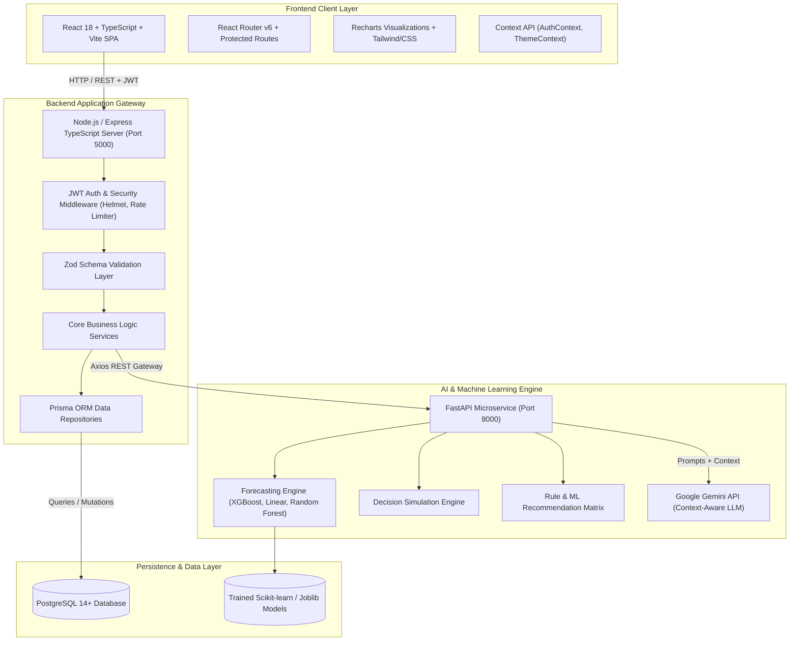
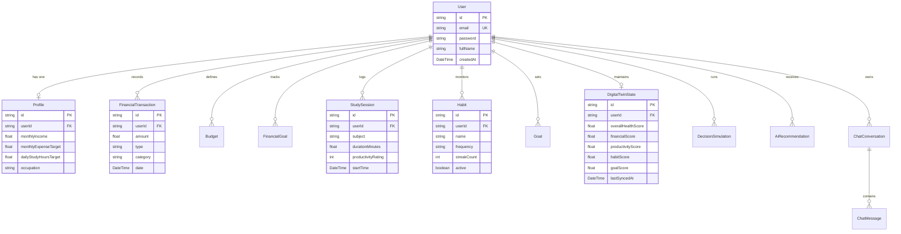

# 🛡️ AI-Based Visual Risk and Compliance Intelligence System

<div align="center">

[](https://react.dev/)
[](https://nodejs.org/)
[](https://fastapi.tiangolo.com/)
[](https://www.postgresql.org/)
[](https://www.docker.com/)
[](https://deepmind.google/technologies/gemini/)
[](https://opensource.org/licenses/MIT)
[]()

<br />

**A state-of-the-art AI-driven personal digital twin, risk analytics, and behavioral intelligence platform. Built with Machine Learning forecasting models, decision simulation engines, real-time life synchronization, and context-aware conversational AI.**

[Explore Features](#-system-features) • [System Architecture](#-system-architecture) • [Quick Start Guide](#-installation--quick-start) • [API & Postman](#-api-endpoints--postman-collection) • [Demo Credentials](#-pre-configured-demo-credentials)

</div>

---

## 📌 Table of Contents

- [Introduction & Overview](#-introduction--overview)
- [System Features](#-system-features)
  - [User & Digital Twin Features](#-user--digital-twin-features)
  - [Risk & Compliance Intelligence](#-risk--compliance-intelligence)
  - [Decision Simulation & What-If Engine](#-decision-simulation--what-if-engine)
  - [Conversational AI Assistant](#-conversational-ai-assistant)
- [System Architecture](#-system-architecture)
- [Database Schema & ERD](#-database-schema--entity-relationship-diagram)
- [Technology Stack](#-technology-stack)
- [Repository Structure](#-repository-structure)
- [Installation & Quick Start](#-installation--quick-start)
  - [Option A: Docker Compose (Recommended)](#option-a-docker-compose-recommended)
  - [Option B: Manual Local Setup](#option-b-manual-local-setup)
- [Database Seeding & Datasets](#-database-seeding--sample-datasets)
- [Pre-Configured Demo Credentials](#-pre-configured-demo-credentials)
- [API Endpoints & Postman Collection](#-api-endpoints--postman-collection)
- [Machine Learning & Predictive Pipeline](#-machine-learning--predictive-pipeline)
- [Security & Compliance](#-security--compliance)
- [Contributing & License](#-contributing--license)

---

## 📖 Introduction & Overview

The **AI-Based Visual Risk and Compliance Intelligence System** is a next-generation predictive digital twin application. It continuously consolidates multi-dimensional personal data across **financial transactions**, **study sessions**, **daily habits**, **fitness activities**, and **long-term goals** into an interactive visual representation of a user's trajectory.

### Core Value Propositions:
- **Holistic Personal Digital Twin**: Calculates dynamic health scores across 4 key pillars: *Financial*, *Productivity*, *Habit Consistency*, and *Goal Velocity*.
- **Statistical & ML Forecasting**: Employs Scikit-learn, XGBoost, and time-series forecasting (Prophet) to project 30-day expense trajectories, burnout risks, and habit sustainability.
- **Interactive Multi-Scenario Simulation**: Empowers users to run "What-If" decision models (e.g., job switch, vehicle purchase, relocation) and project financial, wellness, and risk implications over 3–24 months.
- **Context-Aware Conversational Intelligence**: Integrated with Google Gemini LLM, injecting real-time user metrics, habit streaks, budget utilization, and recent decisions into the agent's context window.

---

## 🌟 System Features

### 👤 User & Digital Twin Features
- **Digital Twin Dashboard**: Real-time visualization of overall wellness index, category radar charts, active risk flags, and 30-day trendlines.
- **Personal Finance Module**:
  - Income and expense logging with automatic category breakdown (Housing, Food, Tech, Leisure, Utilities).
  - Monthly budget threshold management with overspending alerts.
  - Multi-goal savings tracker with automated milestone projection.
- **Study & Productivity Tracker**:
  - Focus session stopwatch and manual session entry with subject categorization.
  - Productivity rating (1–5) and focus efficiency metrics.
  - Automated weekly study burnout risk assessment.
- **Habit & Streak Tracker**:
  - Daily habit checkboxes with automatic streak counter and completion velocity.
  - ML completion probability scoring based on historical behavioral patterns.
- **Goal Management**:
  - Multi-tiered goal tracker across Financial, Academic, Career, Fitness, and Personal domains.
  - Milestone-based progress bars and target completion dates.

### 🛡️ Risk & Compliance Intelligence
- **Automated Financial Risk Scoring**: Flags volatile spending spikes, negative cash-flow trajectories, and emergency fund depletion risks.
- **Habit Vulnerability Matrix**: Pinpoints neglected habits before streaks break.
- **Burnout Early-Warning System**: Analyzes high study/work intensity combined with low sleep/wellness habit logs to warn users of impending fatigue.
- **Compliance & Goal Alignment**: Compares actual daily actions against user-defined targets to compute adherence percentages.

### 🎲 Decision Simulation & What-If Engine
- **Scenario Comparison**: Side-by-side comparison between **Status Quo (Current Path)**, **Proposed Decision Scenario**, and **Optimized Alternative**.
- **Financial & Goal Impact Metrics**:
  - Net worth impact over 6, 12, and 24 months.
  - Goal delay or acceleration factor (in days/weeks).
  - Risk Level classification: `LOW`, `MODERATE`, `HIGH`, `CRITICAL`.
- **Actionable AI Verdict**: Generates structured pros, cons, mitigation steps, and recommended course of action.

### 🤖 Conversational AI Assistant
- **Real-Time Context Injection**: AI assistant has zero-shot memory of the user's latest balances, active goals, failed habits, and simulated decisions.
- **Gemini API & Fallback Resilience**: Powered by Google Gemini 1.5/2.0 API with a built-in rule-based fallback system for seamless offline execution.
- **Actionable Advice**: Provides tailored recommendations for budget rebalancing, study schedule optimization, and habit recovery.

---

## 🏗️ System Architecture



---

## 🗄️ Database Schema & Entity Relationship Diagram

The PostgreSQL database is managed through **Prisma ORM**, enforcing relational integrity, automated timestamps, and cascading deletes across 12 models:



---

## 🛠️ Technology Stack

| Layer | Primary Technologies | Key Libraries / Frameworks |
| :--- | :--- | :--- |
| **Frontend UI/UX** | React 18, TypeScript, Vite | React Router v6, Recharts, Lucide React, Axios, CSS Glassmorphism |
| **Backend API** | Node.js 18+, Express.js, TypeScript | Prisma ORM, JSON Web Tokens (JWT), bcryptjs, Zod, Helmet, Express Rate Limit |
| **AI / ML Service** | Python 3.10+, FastAPI, Uvicorn | Scikit-learn, Pandas, NumPy, XGBoost, Prophet, Joblib, Pydantic v2 |
| **LLM Orchestration** | Google Gemini API (1.5 Flash/Pro) | Custom Context Engine with Prompt Injection & Rule-based fallback |
| **Database** | PostgreSQL 14+ | Prisma Migrate, Raw SQL Seed Scripts, CSV Data Loaders |
| **DevOps & Containers**| Docker, Docker Compose | Multi-stage Dockerfiles, Automated health checks, Environment Isolation |

---

## 📁 Repository Structure

```
AI-Driven-Digital-Twin/
├── ai-service/                        # Python FastAPI Machine Learning & LLM Service
│   ├── app/
│   │   ├── routes/                    # API route handlers (chat, finance, study, simulate, etc.)
│   │   ├── services/                  # ML models, prediction pipelines & Gemini LLM engine
│   │   └── main.py                    # FastAPI entrypoint & middleware configuration
│   ├── models/                        # Serialized .joblib trained machine learning models
│   ├── requirements.txt               # Python package dependencies
│   └── Dockerfile                     # AI service container definition
│
├── backend/                           # Node.js + Express + TypeScript Application Server
│   ├── prisma/
│   │   ├── schema.prisma              # Complete database schema definition
│   │   └── seed.ts                    # Automated database seeder with realistic test data
│   ├── src/
│   │   ├── config/                    # Environment variables & constants
│   │   ├── controllers/               # HTTP request controllers (Auth, Finance, Twin, etc.)
│   │   ├── database/                  # Prisma client singleton instance
│   │   ├── middleware/                # JWT verification, CORS, error handling
│   │   ├── repositories/              # Database data access layer
│   │   ├── routes/                    # Express REST route definitions
│   │   ├── scripts/                   # CLI seed & data migration scripts
│   │   ├── services/                  # Business logic & AI service client
│   │   ├── validators/                # Zod request validation schemas
│   │   └── server.ts                  # Backend server bootstrap entrypoint
│   ├── package.json                   # Backend dependencies & npm scripts
│   └── Dockerfile                     # Backend container definition
│
├── frontend/                          # React + TypeScript + Vite Single Page Application
│   ├── src/
│   │   ├── components/                # Reusable UI components (Sidebar, TopNav, ChatModal, etc.)
│   │   ├── contexts/                  # AuthContext, ThemeContext, TwinContext
│   │   ├── pages/                     # Application pages (Dashboard, Finance, Study, Habits, Twin, Simulations)
│   │   ├── services/                  # Axios API client & endpoints
│   │   ├── App.tsx                    # Root routing configuration
│   │   └── main.tsx                   # React DOM entry point
│   ├── package.json                   # Frontend dependencies & scripts
│   └── Dockerfile                     # Frontend container definition
│
├── sample_digital_twin_seed.sql       # Standalone PostgreSQL SQL seed data
├── sample_finance_transactions.csv    # 12-month sample financial records
├── sample_study_sessions.csv          # 6-month historical study log dataset
├── sample_habits.csv                  # 180-day habit tracking dataset
├── sample_goals.csv                   # Curated multi-category goal dataset
├── Postman_Collection.json            # Complete Postman API collection for testing
├── docker-compose.yml                 # Multi-container orchestration (DB, Backend, AI, Frontend)
├── start-all.bat                      # Windows one-click local startup script
├── start-all.ps1                      # PowerShell one-click local startup script
└── README.md                          # Master documentation
```

---

## 🚀 Installation & Quick Start

### Prerequisites
- **Node.js**: v18.0.0 or later
- **Python**: v3.10 or later
- **PostgreSQL**: v14.0 or later *(or Docker)*
- **Git**: Installed and configured

---

### Option A: Docker Compose (Recommended)

Run the entire application stack (PostgreSQL, Express Backend, FastAPI AI Service, and React Frontend) with a single command:

```bash
# 1. Clone the repository
git clone https://github.com/Divakar-0777/AI-Driven-Digital-Twin.git
cd AI-Driven-Digital-Twin

# 2. Build and launch all services
docker-compose up --build
```

- **Frontend**: `http://localhost:5173`
- **Backend API**: `http://localhost:5000`
- **AI Microservice**: `http://localhost:8000/docs`

---

### Option B: Manual Local Setup

#### 1. Setup PostgreSQL Database
```bash
# Create database
psql -U postgres -c "CREATE DATABASE ai_digital_twin;"
```

#### 2. Configure and Run Backend
```bash
cd backend

# Create .env configuration
cp .env.example .env

# Install dependencies
npm install

# Run database migrations and seed data
npx prisma migrate dev --name init
npx prisma db seed

# Start development server
npm run dev
```
*Backend runs on `http://localhost:5000`.*

#### 3. Configure and Run AI Service
```bash
cd ../ai-service

# Create Python virtual environment
python -m venv venv

# Activate virtual environment
# Windows:
venv\Scripts\activate
# macOS/Linux:
# source venv/bin/activate

# Install dependencies
pip install -r requirements.txt

# Start FastAPI server
uvicorn app.main:app --reload --port 8000
```
*AI service runs on `http://localhost:8000` (Swagger UI at `/docs`).*

#### 4. Configure and Run Frontend
```bash
cd ../frontend

# Install dependencies
npm install

# Start Vite dev server
npm run dev
```
*Frontend runs on `http://localhost:5173`.*

---

## 📊 Database Seeding & Sample Datasets

The repository comes pre-loaded with comprehensive seed scripts and CSV datasets for immediate demonstration:

| File Name | Record Count | Description |
| :--- | :--- | :--- |
| `sample_digital_twin_seed.sql` | 150+ SQL rows | Complete database seed including user accounts, profile, transactions, habits, study sessions, and twin states. |
| `sample_finance_transactions.csv` | 12 Months Data | Historical income & categorized expenses (Rent, Groceries, Utilities, Subscriptions, Salary). |
| `sample_study_sessions.csv` | 6 Months Data | Timestamped study sessions with duration, productivity ratings, and subjects. |
| `sample_habits.csv` | 180 Days Data | Multi-habit tracker records with streaks (Exercise, Reading, Deep Work, Meditation). |
| `sample_goals.csv` | 10+ Goals | Short-term and long-term milestones with target values and deadlines. |

To populate the database using the TypeScript automated seed script:
```bash
cd backend
npx prisma db seed
```

---

## 🔑 Pre-Configured Demo Credentials

The seeded database contains fully configured demonstration accounts populated with historical data:

| Account Type | Email Address | Password | Pre-Loaded Profile Data |
| :--- | :--- | :--- | :--- |
| **Primary Demo User** | `demo@digitaltwin.ai` | `Demo@123` | 12 months finance, 6 months study logs, 180 days habits, active simulation, synced twin state. |
| **Secondary Test User**| `alex.carter@example.com` | `Password123!` | Active savings goals, custom budget thresholds, and productivity records. |

---

## 📡 API Endpoints & Postman Collection

Import [`Postman_Collection.json`](./Postman_Collection.json) into Postman for instant testing across all endpoints.

### Authentication & Profile
| Method | Endpoint | Description | Auth Required |
| :--- | :--- | :--- | :---: |
| `POST` | `/api/register` | Register a new user account with profile | ❌ |
| `POST` | `/api/login` | Authenticate user & receive JWT Bearer token | ❌ |
| `GET` | `/api/auth/me` | Retrieve authenticated user profile | ✅ |
| `GET` | `/api/profile` | Get full user profile and targets | ✅ |
| `PUT` | `/api/profile` | Update profile settings and target metrics | ✅ |

### Finance & Budgeting
| Method | Endpoint | Description | Auth Required |
| :--- | :--- | :--- | :---: |
| `GET` | `/api/transactions` | List all user transactions (filtered/paginated) | ✅ |
| `POST` | `/api/transactions` | Add a new income/expense record | ✅ |
| `GET` | `/api/transactions/summary`| Fetch monthly category breakdown & totals | ✅ |
| `GET` | `/api/finance/budgets` | List monthly category budgets | ✅ |
| `POST` | `/api/finance/budgets` | Set or update a category budget limit | ✅ |
| `GET` | `/api/finance/goals` | List financial savings goals | ✅ |
| `POST` | `/api/finance/goals` | Create a new financial savings target | ✅ |

### Study & Habits
| Method | Endpoint | Description | Auth Required |
| :--- | :--- | :--- | :---: |
| `GET` | `/api/study` | List study sessions with productivity ratings | ✅ |
| `POST` | `/api/study` | Log a completed study session | ✅ |
| `GET` | `/api/study/total-hours` | Get aggregate study hours & weekly metrics | ✅ |
| `GET` | `/api/habits` | List all active habits with current streak counts | ✅ |
| `POST` | `/api/habits` | Create a new habit to track | ✅ |
| `PUT` | `/api/habits/:id` | Toggle habit completion / increment streak | ✅ |

### Digital Twin, Simulation & AI
| Method | Endpoint | Description | Auth Required |
| :--- | :--- | :--- | :---: |
| `GET` | `/api/digital-twin` | Retrieve current multi-pillar Twin health state | ✅ |
| `POST` | `/api/digital-twin/sync` | Recompute scores from latest user activity | ✅ |
| `POST` | `/api/decision-simulations/run`| Execute a 3-scenario What-If simulation | ✅ |
| `GET` | `/api/decision-simulations` | Retrieve user simulation history | ✅ |
| `POST` | `/api/chat` | Send message to Context-Aware AI Assistant | ✅ |
| `GET` | `/api/recommendations/v2` | Fetch AI-generated risk & optimization advice | ✅ |

---

## 🧠 Machine Learning & Predictive Pipeline

```mermaid
flowchart LR
    subgraph Data["Input Data Sources"]
        D1[Financial Records]
        D2[Study Sessions]
        D3[Habit Logs]
    end

    subgraph FeatureEngineering["Feature Engineering"]
        F1[Rolling 7/30-Day Averages]
        F2[Streak Consistency Index]
        F3[Category Variance & Volatility]
    end

    subgraph Models["ML Algorithms"]
        M1[XGBoost Regressor]
        M2[Scikit-learn Random Forest]
        M3[Time Series Prophet]
    end

    subgraph Outputs["Predictive Insights"]
        O1[30-Day Expense Trajectory]
        O2[Burnout Risk Probability]
        O3[Habit Success Forecast]
    end

    Data --> FeatureEngineering --> Models --> Outputs
```



1. **Financial Trajectory Forecasting**: Evaluates rolling expenses against linear and XGBoost regression models to predict end-of-month balance and overspending likelihood.
2. **Productivity & Burnout Analytics**: Models session duration, frequency, and subjective ratings to compute productivity curves and detect overexertion trends.
3. **Habit Sustainability Classification**: Employs classification trees to determine the probability of a user sustaining a habit based on day-of-week adherence patterns.
4. **Context-Injected Generative AI**: Formats raw telemetry into structured Markdown prompts for the Google Gemini LLM, returning precise, contextual coaching.

---

## 🔒 Security & Compliance

- **Authentication & Authorization**: Stateless JSON Web Tokens (JWT) signed with HMAC-SHA256 and expiration controls.
- **Password Security**: Passwords hashed using `bcryptjs` with 10 salt rounds before persistence.
- **Strict Data Isolation**: All database queries and mutations enforce tenant-level `userId` scoping to prevent cross-account data leakage.
- **Input Validation**: End-to-end type safety using `Zod` schemas on all inbound REST payloads.
- **HTTP Hardening**: Configured with `Helmet.js` to protect against Cross-Site Scripting (XSS), Clickjacking, and MIME sniffing.
- **Rate Limiting**: Built-in protection against brute-force and Denial-of-Service attacks.

---

## 🤝 Contributing & License

### How to Contribute:
1. **Fork** the repository.
2. Create your feature branch: `git checkout -b feature/AmazingFeature`.
3. Commit your changes: `git commit -m 'feat: Add AmazingFeature'`.
4. Push to the branch: `git push origin feature/AmazingFeature`.
5. Open a **Pull Request**.

### License
Distributed under the **MIT License**. See `LICENSE` for more information.

---

<div align="center">

**Developed with ❤️ by Divakar**  
*AI-Based Visual Risk and Compliance Intelligence System*

</div>
